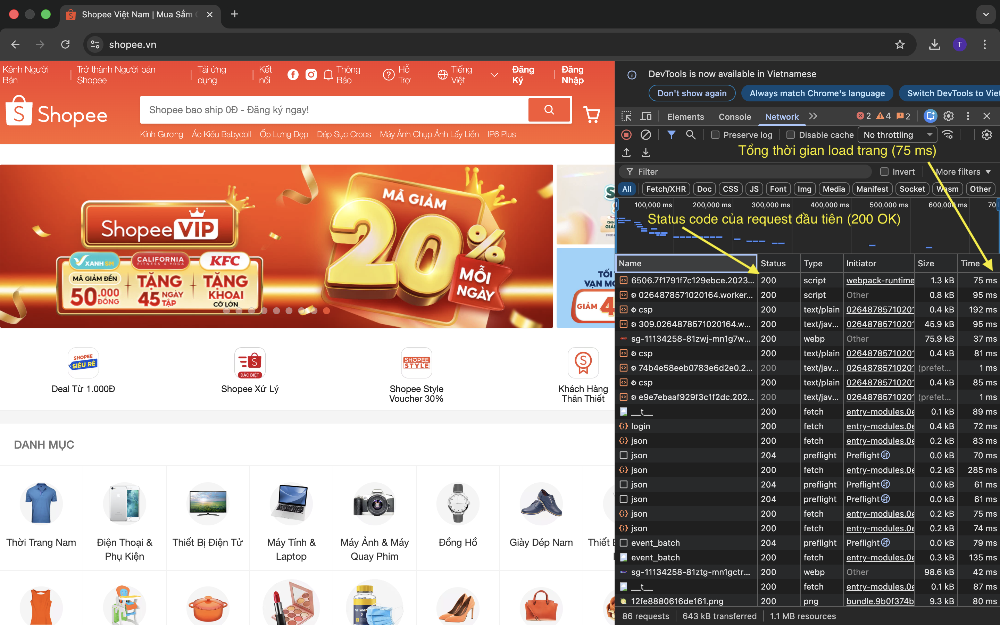
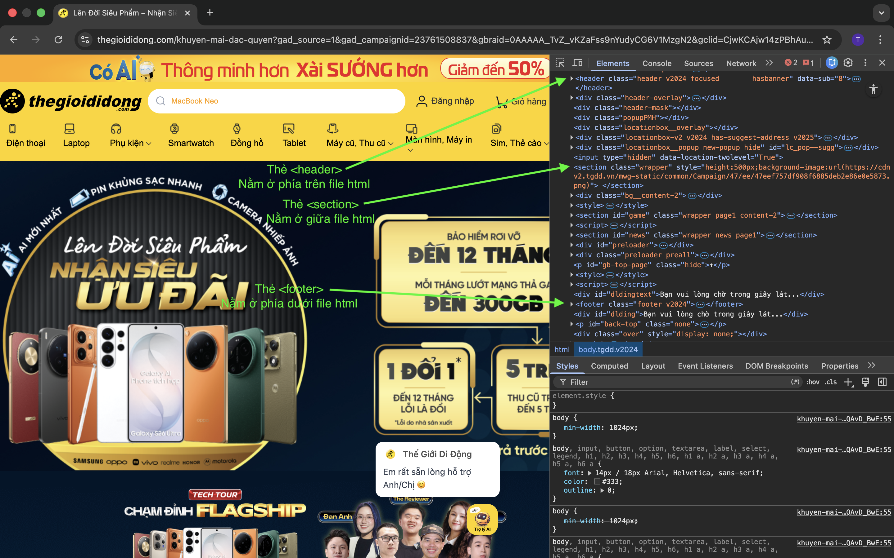
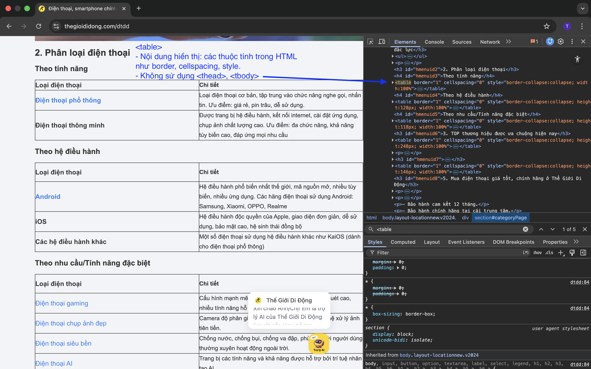
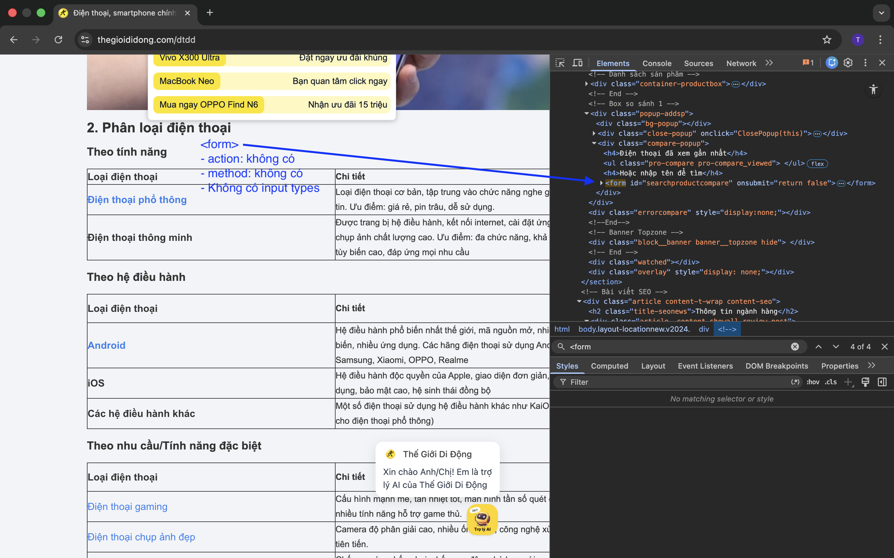

# PHẦN A - KIỂM TRA ĐỌC HIỂU
## Câu A1:
### 1. Khi gõ https://shopee.vn vào trình duyệt và nhấn Enter, liệt kê đúng thứ tự ít nhất 5 bước xảy ra (từ DNS lookup đến render):
    - B1: Gõ URL, nhấn Enter.
    - B2: HTTP Request.
    - B3: Server xử lý.
    - B4: HTTP Response.
    - B5: Trình duyệt hiện trang.
##### Nguồn tham chiếu: 01_introduction_html_universe.md, mục 1.1

### 2. Trong DevTools của Chrome, tab Network cho thấy:
- Name: Tên request.
- Status: Trạng thái (200 OK, 204 No Content, ...).
- Type: Định dạng (script, text/plain, text/javascript, ...).
- Initiator: Ai gọi request.
- Size: Dung lượng.
- Time: Thời gian tải.
#### Mở một trang web bất kỳ, chụp screenshot tab Network và đánh dấu (vẽ mũi tên/khoanh tròn)

.png)
##### Nguồn tham chiếu: 01_introduction_html_universe.md, mục 4.3

## Câu A2:
### Trang web bị Google đánh giá SEO thấp vì dùng quá nhiều thẻ <div> thay cho các thẻ HTML có ý nghĩa (Semantic). Điều này làm máy tìm kiếm và trình đọc màn hình khó hiểu cấu trúc nội dung.
### Lỗi semantic chính:
- Dùng `<div>` cho phần đầu trang thay vì thẻ `<header>`.
- Dùng `<div>` cho menu điều hướng thay vì thẻ `<nav>`.
- Dùng `<div>` cho nội dung sản phẩm và tiêu đề thay vì `<article>` và `<h1>`.
- Dùng `<div>` cho chân trang thay vì thẻ `<footer>`.
### Sửa lại HTML semantic:
```
<header class="header">
    <div class="logo">ShopTLU</div>
    <nav class="menu">
        <a href="/">Trang chủ</a>
        <a href="/products">Sản phẩm</a>
    </nav>
</header>
<main class="main">
    <article class="product">
        <h1 class="title">iPhone 16 Pro</h1>
        <p class="price">25.990.000đ</p>
        <figure class="image">
            
            <figcaption>Hình ảnh iPhone 16 Pro</figcaption>
        </figure>
    </article>
</main>
<footer class="footer">© 2026 ShopTLU</footer>
```
##### Nguồn tham chiếu: 04_visible_part_html mục "Semantic HTML5 — "Thẻ có ý nghĩa"

## Câu A3
### Mô tả bằng text art kết quả hiển thị của đoạn HTML:
`<div>`Hộp 1`</div>`  
`<span>`Text A`</span>`  
`<span>`Text B`</span>`  
`<div>`Hộp 2`</div>`  
`<span>`Text C`</span>`  
`<strong>`Text D`</strong>`  
`<div>`Hộp 3`</div>`  

#### Kết quả mô tả
Hộp 1  
Text A Text B  
Hộp 2  
Text C *Text D*  
Hộp 3  

### Giải thích:
1. Hộp 1 nằm trong thẻ `<div>` nên là một dòng riêng.
2. Text A và Text B nằm trong thẻ `<span>` nên nằm cùng một dòng.
3. Hộp 2 nằm trong thẻ `<div>` nên xuống một dòng mới. 
4. Text C nằm trong thẻ `<span>` và Text D nằm trong thẻ `<strong>` nên nằm cùng một dòng.
5. Thẻ `<strong>` để in đậm văn bản của "Text D"
6. Hộp 3 nằm trong thẻ `<div>` nên xuống một dòng mới.

##### Nguồn tham chiếu: 04_visible_part_html mục "Block vs Inline — Hai loại element cơ bản"

## Câu A4:
### Sự khác nhau giữa `<thead>`, `<tbody>`, `<tfoot>`:
- `<thead>`: Dùng cho Header (tiêu đề cột).
- `<tbody>`: Dùng cho Body (dữ liệu chính).
- `<tfoot>`: Dùng cho Footer (tổng kết).
### KHÔNG NÊN dùng table để tạo layout trang web vì:
1. Sai lệch semantic: table chỉ dùng cho dữ liệu dạng bảng, không dùng cho layout.
2. Ảnh hưởng SEO: công cụ tìm kiếm hiểu sai nội dung.
3. Accessibility kém: trình đọc màn hình (screen reader) đọc rối.
4. Hiệu suất chậm: phải tải toàn bộ bảng trước render.
5. Khó bảo trì: code phức tạp khi lồng nhiều tầng.
6. Không responsive: không scale tốt trên mobile.
##### Nguồn tham chiếu: 05_tables_hyperlinks
<br>

# PHẦN B - THỰC HÀNH CODE
## Bài B1: làm trong [profile.html](profile.html)

## Bài B2: làm trong [products.html](products.html)

## Bài B3:
### Bản sửa trong file [debug.html](debug.html)
### Liệt kê từng lỗi theo format:
#### Lỗi 1: Dòng X — Mô tả lỗi — Cách sửa
#### Lỗi 2: ...
- Lỗi 1: Dòng 1 — Thiếu "html" sau DOCTYPE — Sửa thành `<!DOCTYPE html>`
- Lỗi 2: Dòng 4 — Thiếu thẻ đóng `</title>` — Thêm `</title>` sau "Trang web"  
- Lỗi 3: Dòng 5 — Charset sai, nên là "utf-8" — Sửa thành `<meta charset="utf-8">`
- Lỗi 4: Dòng 8 — Thiếu dấu / trong thẻ đóng `</h1>` — Sửa thành `<h1>Welcome to ShopTLU</h1>`
- Lỗi 5: Dòng 12 — Thiếu dấu / trong thẻ đóng `</a>` — Sửa thành `<a href="home">Trang chủ</a>`  
- Lỗi 6: Dòng 20 — Thiếu dấu ngoặc kép quanh src — Sửa thành `` sau `</p>` — Sửa thành `<p>Giá: <b>25.990.000đ</b></p>` 
- Lỗi 8: Dòng 40-42 — Có hai thẻ `<main>`, vi phạm semantic HTML5 (chỉ nên có một `<main>`) — Thay thẻ `<main>` thứ hai thành `<aside>` để làm sidebar  
- Lỗi 9: Dòng 44 — Thiếu thẻ đóng `</p>` — Thêm `</p>` sau "Copyright 2026"    
- Lỗi 10: Dòng 12 — href="home" nên là URL hợp lệ, semantic — Sửa thành `<a href="#home">Trang chủ</a>` 
- Lỗi 11: Dòng 13 — href="products" nên là URL hợp lệ — Sửa thành `<a href="products.html">Sản phẩm</a>`
- Lỗi 12: Dòng 20 — src="iphone.jpg" nên có đường dẫn tương đối đầy đủ — Sửa thành `` (giả sử trong thư mục images)

## Bài B4:
### 1. Ba thẻ semantic HTML5 mà trang đó sử dụng (ghi rõ thẻ gì, ở đâu)
- Thẻ `<header>`: Nằm ở phía trên file .html
- Thẻ `<section>`: Nằm ở giữa file .html
- Thẻ `<footer>`: Nằm ở phía dưới file .html


### 2. Tìm 1 `<table>` trên trang:
- Nội dung mà `<table>` hiển thị: các thuộc tính trong HTML như border, cellspacing, style.
- Không sử dụng thẻ `<thead>` và `<tbody>`.


### 3. Tìm 1 `<form>` trên trang:
- Form không có action hay method.
- Không có input types nào được dùng.

<br>

# PHẦN C - SUY LUẬN
## Câu C1 - Kết quả được viết vào flle [product_detail.html](products_detail.html)

## Câu C2 - Đoạn phản biện quan điểm của đồng nghiệp:
- Mặc dù dùng `<div>` cho mọi thứ có vẻ tiết kiệm thời gian, nhưng nhưng nó bỏ qua những vấn đề kỹ thuật và kinh tế lâu dài.
- Trước hết là về SEO. Máy tìm kiếm như Google sử dụng semantic HTML để phân tích cấu trúc trang. Khi bạn dùng `<header>`, `<nav>`, `<article>`, `<footer>`, Google hiểu rõ phần nào là tiêu đề, phần nào là nội dung chính. Nhưng nếu tất cả đều là `<div>`, công cụ tìm kiếm gặp khó khăn trong việc xác định nội dung chính → xếp hạng SEO tụt dốc. Một trang e-commerce dùng `<article>` cho sản phẩm sẽ xếp hạng cao hơn trang dùng `<div class="product">` trên Google.
- Tiếp đến là về Accessibility. Người khiếm thị dùng screen reader để duyệt web. Nếu bạn dùng `<nav>` cho menu, screen reader sẽ nói "Navigation menu", giúp người dùng hiểu ngay. Nhưng nếu dùng `<div class="navigation">`, screen reader sẽ chỉ được đọc là "div", khiến trải nghiệm của người dùng trở nên tồi tệ và vi phạm WCAG. Công ty có thể bị kiện hoặc mất uy tín.
- Ta lấy một ví dụ: Một website dùng `<header>`, `<nav>`, `<section>` sẽ có cấu trúc rõ ràng cho cả máy tìm kiếm lẫn screen reader. Còn website dùng `<div>` cho tất cả sẽ khó để máy tìm kiếm lẫn screen reader có thể hiểu đúng.
- Tuy nhiên, `<div>` vẫn cần thiết cho layout tuỳ chỉnh, chẳng hạn `<div class="container">, <div class="grid-wrapper">`. Vậy nên giải pháp tốt nhất là dùng semantic HTML cho cấu trúc chính, và `<div>` cho layout chi tiết.